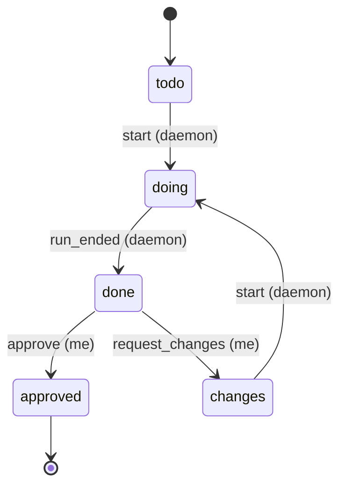

# Step states

Drawn by hand from `TABLE` in `src/hubd/states.py`. Each arrow is one row: `event (actor)`.
A move that is not an arrow here raises `InvalidTransition`.

```mermaid
stateDiagram-v2
    [*] --> todo
    todo --> doing: start (daemon)
    changes --> doing: start (daemon)
    doing --> done: run_ended (daemon)
    done --> approved: approve (me)
    done --> changes: request_changes (me)
    approved --> [*]
```
